# 《Python程序设计基础》程序设计作品说明书

题目： 你选择的项目题目

学院： 21计科03班

姓名： 李亚儒

学号： B20210302323
指导教师： 周景

起止日期：2023.11.10-2023.12.10

## 摘要

在windows下使用python语言实现《外星人入侵》游戏项目。本说明书简单介绍了该游戏项目的基本设计思路和方法，在该游戏中，玩家控制一艘飞船射击出现的外星人，飞船可在一定范围内左右移动并自由射击，击中外星人可以增加分数，外星人可以撞毁飞船，当玩家损失三艘飞船时，游戏结束。本项目能够帮助用户进一步理解和掌握Python各种基本类型的变量、数据类型、类、用户输入和文件操作实现面向对象的游戏开发，以及它们在程序中的使用方法。

关键词：python，游戏，外星人入侵

## 第1章 需求分析

### 1.1功能需求

(1) 初始游戏界面，点击play开始游戏。
(2) 游戏中的飞船移动需要在屏幕范围内。
(3) 游戏中的子弹发射需要在屏幕范围内。
(4) 游戏中的外星人需限制一定数量，全部被消灭后再次生成限定数量的外星人。
(5) 游戏中的子弹击中外星人时，外星人与子弹一起消失。
(6) 游戏中使用记分板来统计分数。
(7) 游戏结束时，游戏结束界面。

### 1.2设计目的

(1) 熟悉Python语言的基本语法。
(2) 熟悉Python语言的面向对象编程。
(3) 熟悉Python语言的文件操作。
(4) 熟悉Python语言的模块。

## 第2章 分析与设计

### 2.1系统架构

系统总体设计模块框图

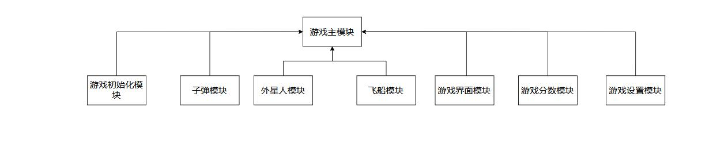

### 2.2系统模块

该项目主要分为八个模块，分别为游戏主模块、外星人模块、飞船模块、子弹模块、游戏界面模块、游戏初始化模块、游戏分数模块、游戏设置模块

### 2.3系统流程

(1)游戏主模块： 本模块主要进行定义和继承的相关操作，实现成员函数的定义和成员属性的定义，继承相关函数并添加相关的游戏特性。

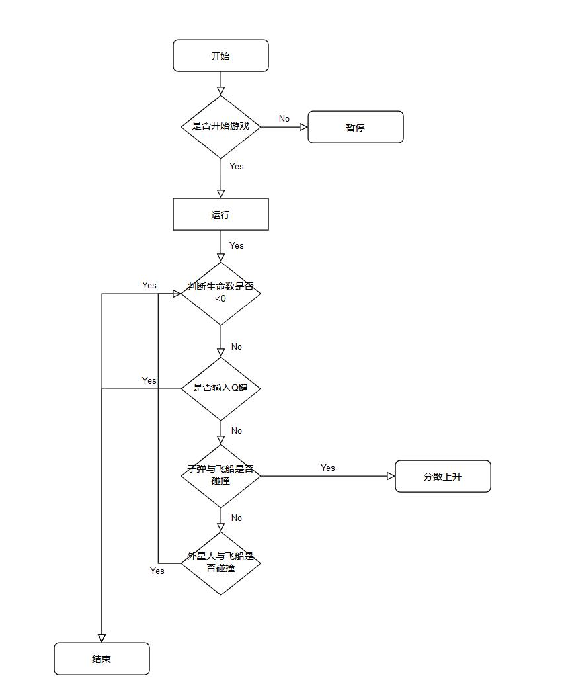

(2)外星人模块： 外星人模块主要进行外星人相关属性的定义，并实现外星人相关属性的相关操作。
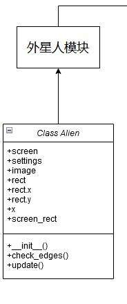

(3)飞船模块： 飞船模块主要进行飞船相关属性的定义，并实现飞船相关属性的相关操作。
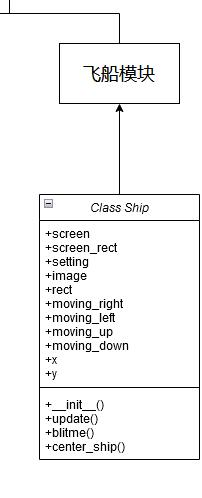

(4)子弹模块： 子弹模块主要进行子弹相关属性的定义，并实现子弹相关属性的相关操作。
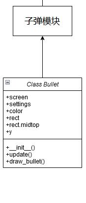

(5)游戏界面模块： 游戏界面模块主要进行游戏界面相关属性的定义，并实现游戏界面相关属性的相关操作。
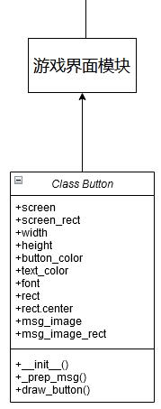

(6)游戏初始化模块： 游戏初始化模块主要进行游戏初始化相关属性的定义，并实现游戏初始化相关属性的相关操作。
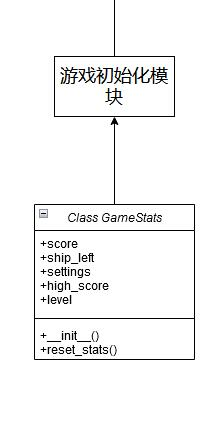

(7)游戏分数模块： 游戏分数模块主要进行游戏分数相关属性的定义，并实现游戏分数相关属性的相关操作。
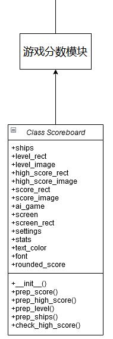

(8)游戏设置模块： 游戏设置模块主要进行游戏设置相关属性的定义，并实现游戏设置相关属性的相关操作。
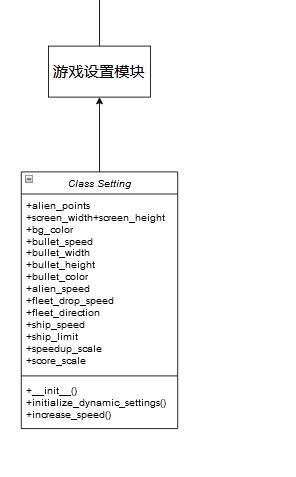

### 2.4数据库设计

本项目并不涉及数据库的设计，所以数据库设计部分省略。

### 2.5关键实现

本项目的实现主要时在于Pygame在python语言使用，在Python语言中，Pygame是一个功能强大的游戏开发库，它提供了许多工具和功能，使得开发2D游戏变得更加简单和高效。Pygame为Python开发者提供了一个强大而灵活的工具集，使他们能够更轻松地创建各种类型的2D游戏和交互式应用程序。无论是初学者还是有经验的开发者，都可以从Pygame中受益，并快速构建出令人惊叹的游戏作品。

## 第3章 软件测试

_本章的内容主要包括以类和函数作为单元进行单元测试，编写的对系统的主要功能的测试用例，以及测试用例执行的测试报告。_

### 3.1单元测试用例

(1)Game_stats类测试

```python
import pytest
from Game_stats import GameStats
from Setting import Settings

class TestGameStats:
    @pytest.fixture
    def ai_game(self):
        settings = Settings()
        return AI_Game(settings)

    def test_reset_stats(self, ai_game):
        stats = GameStats(ai_game)  # 创建GameStats实例
        stats.score = 100  # 设置分数为100
        stats.ships_left = 2  # 设置飞船剩余数量为2
        stats.reset_stats()  # 调用reset_stats方法重置统计信息
        assert stats.score == 0  # 检查分数是否被重置为0
        assert stats.ships_left == ai_game.settings.ship_limit  # 检查飞船剩余数量是否被重置为初始值
        assert stats.high_score == 0  # 检查高分是否被重置为0
        assert stats.level == 1  # 检查等级是否被重置为1

class AI_Game:
    def __init__(self, settings):
        self.settings = settings

class Settings:
    def __init__(self):
        self.ship_limit = 3
```

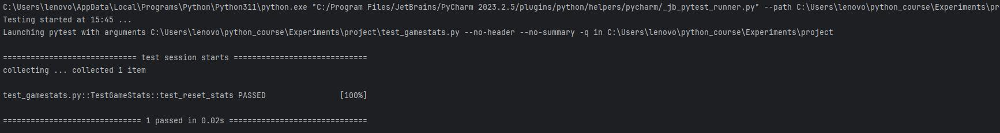

(2)bullet类测试

```python
import pygame
from Bullet import Bullet


def test_bullet_update():
    ai_game = MockAiGame()  # 这里需要自行实现一个 MockAiGame 类
    bullet = Bullet(ai_game)
    bullet.update()
    assert bullet.rect.y == bullet.y


class MockAiGame:
    def __init__(self):
        self.screen = pygame.Surface((800, 600))
        self.settings = MockSettings()
        self.ship = MockShip()


class MockSettings:
    def __init__(self):
        self.bullet_color = (255, 255, 255)  # 设置合适的颜色
        self.bullet_width = 5  # 设置合适的宽度
        self.bullet_height = 10  # 设置合适的高度
        self.bullet_speed = 2  # 设置合适的速度


class MockShip:
    def __init__(self):
        self.rect = pygame.Rect(0, 0, 10, 10)  # 设置合适的坐标

    @property
    def midtop(self):
        return self.rect.midtop

```

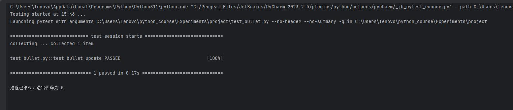

(3)alien类测试

```python
import pygame
from Alien import Alien


# 创建一个虚拟的ai_game实例，可以使用Mock等方式
class MockSettings:
    alien_speed = 1
    fleet_direction = 1


class MockScreen:
    def get_rect(self):
        return pygame.Rect(0, 0, 800, 600)


class MockAiGame:
    def __init__(self):
        self.screen = MockScreen()
        self.settings = MockSettings()


def test_alien_update():
    ai_game = MockAiGame()
    alien = Alien(ai_game)

    alien.update()
    assert alien.rect.x == 61  # 验证横向移动是否符合预期


def test_alien_check_edges():
    ai_game = MockAiGame()
    alien = Alien(ai_game)

    screen_rect = alien.screen.get_rect()
    alien.rect.x = screen_rect.right - 1
    assert alien.check_edges() == True  # 验证边缘检查是否符合预期

    alien.rect.x = 0
    assert alien.check_edges() == True  # 验证边缘检查是否符合预期

    alien.rect.x = 10
    assert alien.check_edges() == False  # 验证边缘检查是否符合预期

```

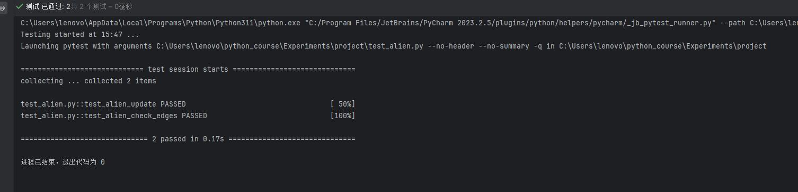

### 3.2总体功能测试

(1)外星人测试
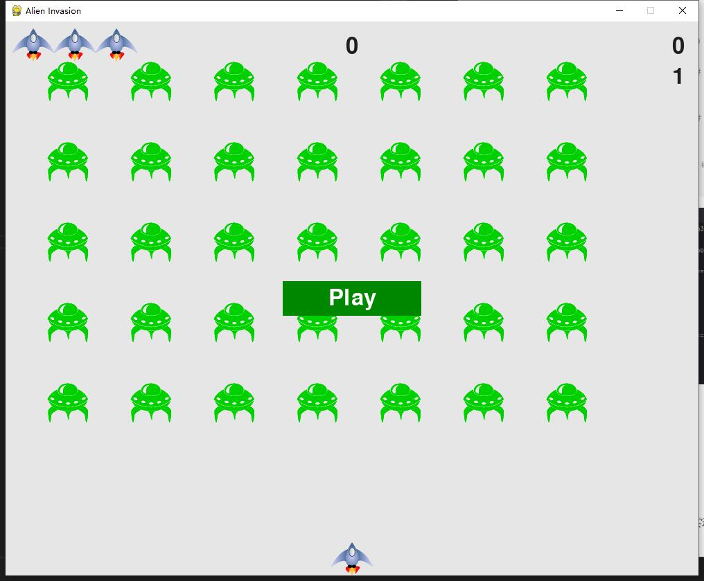

(2)飞船测试
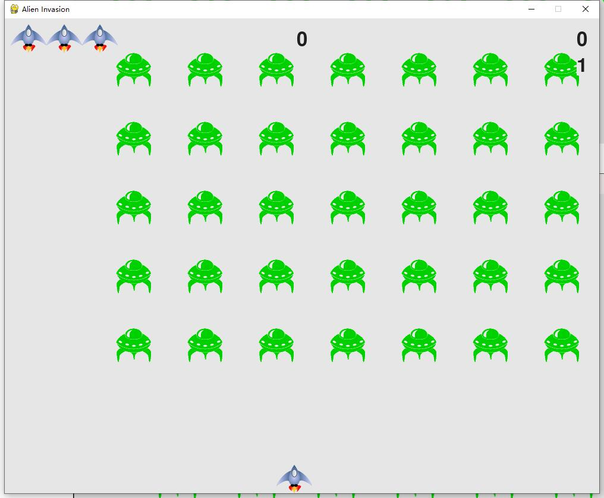

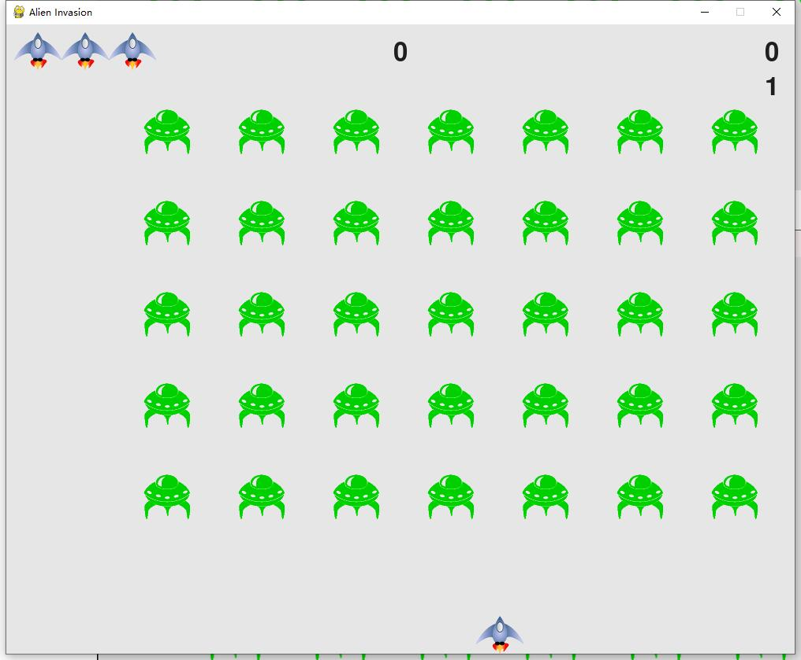

(3)子弹测试
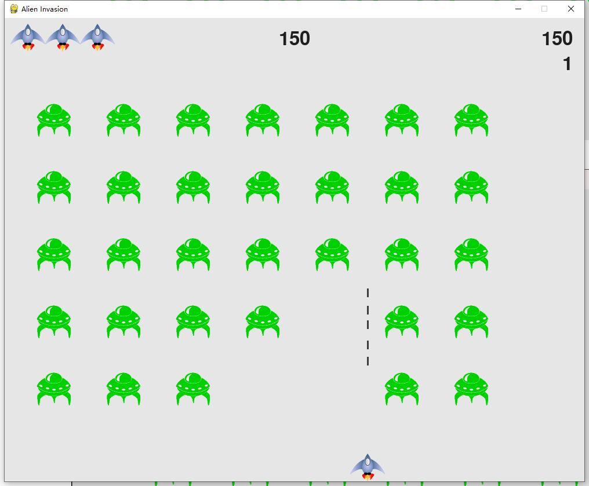

(4)计分板测试
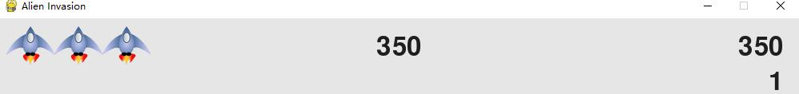

(5)生命测试
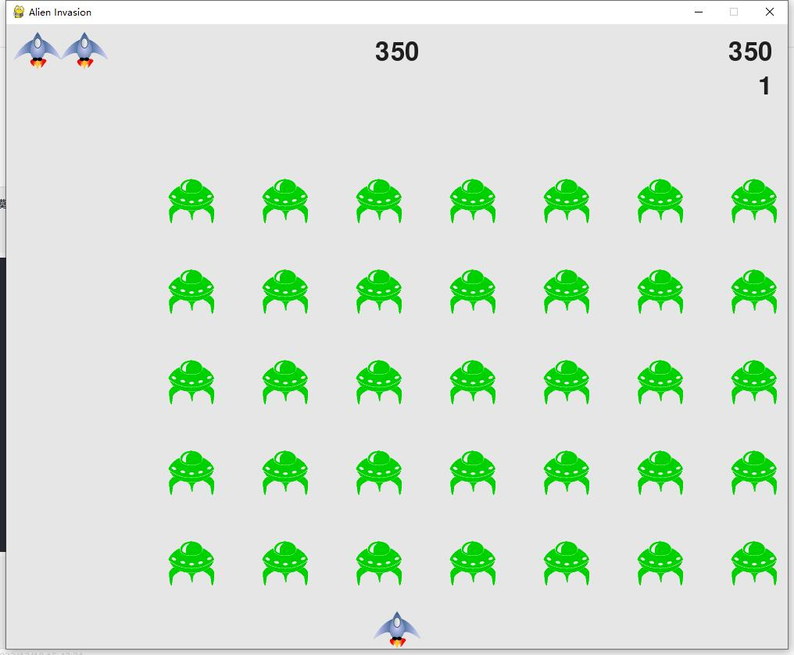

(6)等级测试
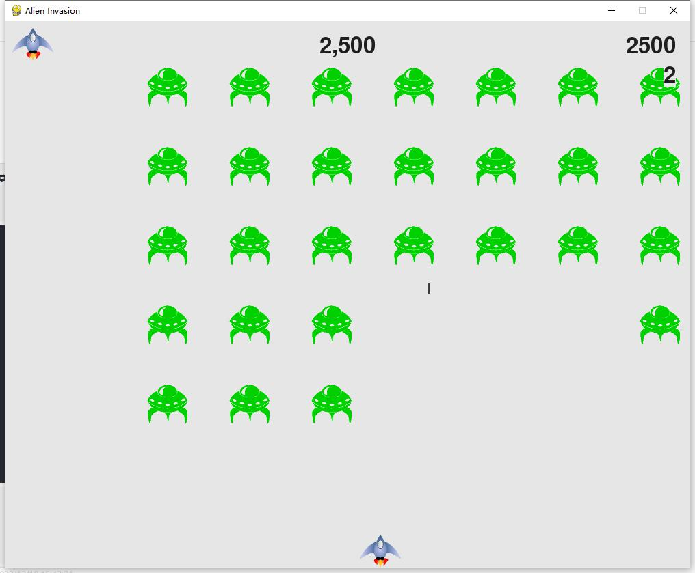

(7)死亡测试
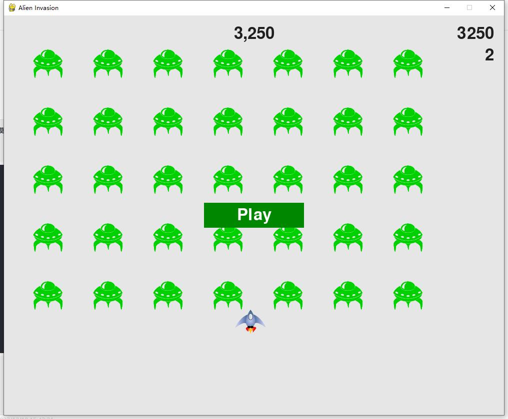

## 结论

本项目实现了外星人入侵的基本功能，玩家控制一艘飞船射击出现的外星人，当子弹击中外星人后和外星人一起消失，击中外星人可以增加分数，将分数实时显示在屏幕中央，设置生命为三，当三次与外星人撞击后游戏结束。本项目还是存在不足之处，比如飞机的攻击模式单一，外星人的行动单一，游戏结束后无法继续游戏，还有游戏界面与开始菜单在同一个画布上，玩家无法选择游戏模式，玩家无法选择难度等级，玩家只能选择开始游戏。

## 参考文献

[美] 埃里克·马瑟斯(Eric Matthes).Python编程-从入门到实践(第3版)[M].袁国忠译.北京: 人民邮电出版社, 2023.8